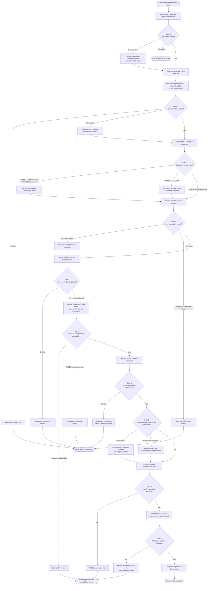

# Watchlist-to-library flow diagram

The diagram describes the target pipeline. The current Alpha11 mediator still
writes catalogue rows during individual item processing and therefore does not
yet provide this global validation boundary.

